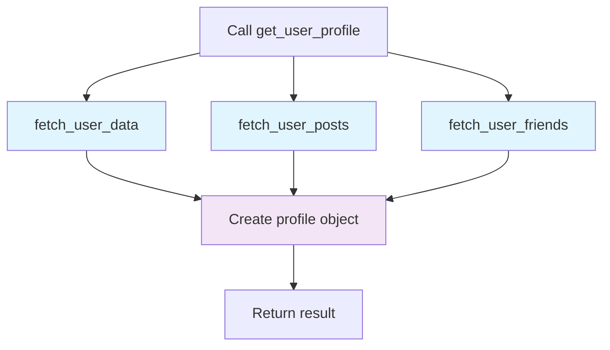

# Ripplex

**Turn your sequential Python code into parallel powerhouse with zero refactoring**

Ripplex is a Python framework that makes parallel execution effortless. Write normal code, add a decorator, and watch it run in parallel automatically.

## Why Ripplex?

- **Zero refactoring**: Add `@flow` to existing functions
- **Smart parallelization**: Automatically detects dependencies 
- **Variable capture**: Access outer scope variables seamlessly
- **Visual debugging**: See exactly what's running when
- **Error resilience**: Multiple strategies for handling failures

## Installation

```bash
pip install ripplex
```

## Quick Start Guide

### 1. Start with `@flow` - The Magic Decorator

The `@flow` decorator is Ripplex's crown jewel. It analyzes your code and runs independent operations in parallel:

```python
from ripplex import flow
import time

def fetch_user_data(user_id):
    """Simulate API call"""
    time.sleep(1)
    return {"id": user_id, "name": f"User {user_id}"}

def fetch_user_posts(user_id):
    """Simulate another API call"""  
    time.sleep(1.5)
    return [f"Post {i} by user {user_id}" for i in range(3)]

def fetch_user_friends(user_id):
    """Simulate third API call"""
    time.sleep(0.8) 
    return [f"Friend {i}" for i in range(5)]

@flow(debug=True)  # Shows execution timeline
def get_user_profile(user_id):
    # These three calls run in PARALLEL automatically
    user = fetch_user_data(user_id)
    posts = fetch_user_posts(user_id) 
    friends = fetch_user_friends(user_id)
    
    # This runs after all three complete
    profile = {
        "user": user,
        "posts": posts, 
        "friends": friends,
        "summary": f"{user['name']} has {len(posts)} posts and {len(friends)} friends"
    }
    
    return profile

# Without @flow: ~3.3 seconds (sequential)
# With @flow: ~1.5 seconds (parallel)
result = get_user_profile(123)
```

#### Execution Flow Visualization



### 2. Parallel Loops with `@loop`

Process collections in parallel with automatic variable capture:

```python
from ripplex import loop
import requests

# Configuration available to all loop iterations
API_KEY = "your-secret-key"
BASE_URL = "https://api.example.com"
batch_size = 100

user_ids = [1, 2, 3, 4, 5, 6, 7, 8, 9, 10]

@loop(user_ids, debug=True)  # Shows progress bar
def fetch_user_details(user_id):
    # API_KEY, BASE_URL, and batch_size are automatically available!
    url = f"{BASE_URL}/users/{user_id}?key={API_KEY}&batch={batch_size}"
    # In real code: response = requests.get(url)
    return {"id": user_id, "data": f"User data for {user_id}"}

# Result: [{"id": 1, "data": "..."}, {"id": 2, "data": "..."}, ...]
print(f"Fetched {len(fetch_user_details)} users")
```

### 3. Real-World Data Pipeline Example

Here's how `@flow` and `@loop` work together:

```python
from ripplex import flow, loop
import time

@flow(debug=True)
def process_sales_data():
    """Complete sales processing pipeline running in parallel"""
    
    # Step 1: These data fetches run in parallel
    raw_sales = fetch_sales_data()          # 2 seconds
    customer_data = fetch_customer_data()   # 1.5 seconds  
    product_catalog = fetch_product_data()  # 1 second
    
    # Step 2: These processing steps also run in parallel
    # (they all depend on the data above, so wait for it)
    cleaned_sales = clean_sales_data(raw_sales)
    enriched_customers = enrich_customer_data(customer_data, product_catalog)
    
    # Step 3: Parallel processing of sales records
    @loop(cleaned_sales, workers=4)
    def process_sale(sale):
        # Automatically has access to enriched_customers!
        customer = enriched_customers.get(sale['customer_id'])
        return {
            **sale,
            'customer_name': customer['name'],
            'customer_tier': customer['tier'],
            'profit_margin': calculate_margin(sale, product_catalog)
        }
    
    # Step 4: Generate reports in parallel
    daily_report = generate_daily_report(process_sale)
    customer_insights = analyze_customers(process_sale)
    
    return {
        'processed_sales': process_sale,
        'daily_report': daily_report, 
        'insights': customer_insights
    }

# Without Ripplex: ~15 seconds sequential
# With Ripplex: ~6 seconds parallel
result = process_sales_data()
```

## Error Handling Made Easy

```python
# Handle errors gracefully in parallel loops
data = [1, 2, 0, 4, 0, 6]  # Some will cause division errors

@loop(data, on_error="collect", debug=True)
def safe_divide(n):
    return 100 / n  # Will fail on zeros

print(f"Successful results: {len(safe_divide)}")           # 4
print(f"Failed operations: {len(safe_divide.errors)}")     # 2  
print(f"Success rate: {safe_divide.success_count}/{safe_divide.total_count}")  # 4/6

# Access specific errors
for index, error in safe_divide.errors.items():
    print(f"Item {index} failed: {error}")
```

## Complete API Reference

### `@flow(debug=False)`

Analyzes function dependencies and parallelizes independent operations.

```python
@flow(debug=True)  # Shows execution timeline
def my_function():
    # Your code here - no changes needed!
    pass
```

**Parameters:**
- `debug` (bool): Show visual execution timeline and timing info

### `@loop(iterable, *, workers=None, debug=False, on_error="continue")`

Processes items in parallel with automatic variable capture. Items are processed concurrently but the decorator waits for all items to complete before returning results.

```python
@loop(items, workers=8, debug=True, on_error="collect")
def process_item(item):
    # Process each item
    return result
```

**Parameters:**
- `iterable`: Items to process (list, range, etc.)
- `workers` (int): Number of threads (default: min(len(items), 32))
- `debug` (bool): Show progress bar with timing
- `on_error` (str): Error handling strategy:
  - `"continue"`: Skip failed items, return successful results
  - `"raise"`: Stop on first error
  - `"collect"`: Continue processing, include None for failures

**Returns:** `LoopResult` (enhanced list with error tracking)

**Note:** `@loop` blocks until all items are processed. Results are returned in the same order as the input, regardless of completion order.

### `pmap(function, iterable, **kwargs)`

Functional-style parallel map.

```python
from ripplex import pmap

# Simple parallel mapping
results = pmap(lambda x: x ** 2, [1, 2, 3, 4])  # [1, 4, 9, 16]

# With error handling
results = pmap(safe_operation, data, on_error="collect")
```

## Tips

- **I/O bound tasks**: Use more workers (`workers=20`)
- **CPU bound tasks**: Use fewer workers (`workers=4`) 
- **Debugging**: Always start with `debug=True`
- **Error handling**: Use `on_error="collect"` to continue processing

## Contributing

We welcome contributions! Here's how to get started:

1. Fork the repository
2. Create a feature branch
3. Add tests for new functionality
4. Submit a pull request

## License

MIT License - see [LICENSE](LICENSE) for details.


---

**Ready to supercharge your Python code?** Start with `@flow` on your existing functions and watch them run in parallel!